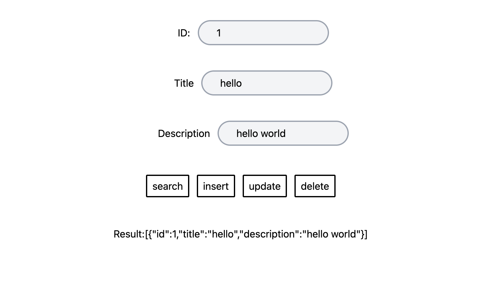

# Programming Test
## Frontend
Use React Next.js and tailwind css as the front end framework. Implement a page with CRUD requests functions.

## Backend
Use Python FastAPI as the framework. Use PostgreSQL on Vercel as the database. Implement a backend server with CRUD functions and connects to a PostgreSQL DB service. The return data is formatted in json.